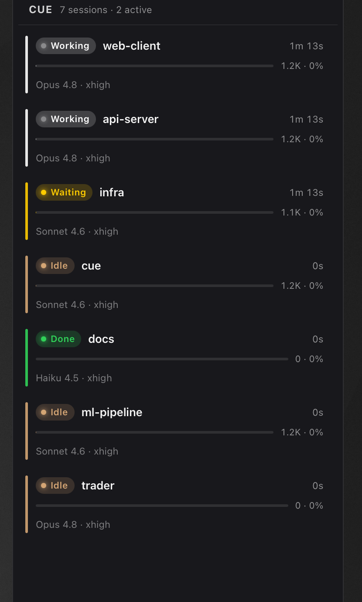

# Cue

A real-time session monitor for Claude Code — see at a glance if Claude is working, waiting for permission, spawning subagents, hit an error, or finished. Cross-platform desktop app for macOS, Windows, and Linux.


[](https://buymeacoffee.com/avonbereghy)

<table align="center">
  <tr>
    <td align="center" valign="top"></td>
    <td align="center" valign="top"></td>
  </tr>
</table>

## Status Indicators

Each Claude Code session appears as a colored dot in your menu bar / system tray:

| Color | Meaning |
|-------|---------|
| Blinking white | Claude is working |
| Blinking cyan | Subagent(s) running |
| Yellow | Waiting for your permission |
| Red | Tool error |
| Green | Done |
| Dim white | Idle |
| Hollow ring | No active sessions |

Multiple sessions show as a grid of dots — see all your sessions at once. Click the icon for a popover with every session's status, model, and token usage (shown top-right above).

## Features

### Session Monitoring
- **Real-time status** — polls every second, blink animation for active sessions
- **Multi-session support** — tracks up to 8 concurrent sessions as a dot grid
- **Subagent awareness** — tracks active subagent count per session, displays "Subagents(N)" badge with live count; parent sessions stay in subagent state while children are running (won't falsely drop to idle/error/waiting from subagent events)
- **Session dashboard** — detailed view with workspace, duration, model, git branch, tool usage, context usage bar
- **Token metrics** — incremental JSONL parsing for input/output/cache token counts per session, aggregated across parent and all subagents
- **Context usage bar** — color-coded progress bar (green → amber → red) showing token usage relative to model context limit (auto-detected: 1M for current models like Opus 4.8 / Sonnet 4.6, 200K for older models)
- **Running tool display** — fixed-width pill showing the currently executing tool and its target (file path, command, pattern) in real-time
- **Output speed** — tokens/sec badge calculated from output token deltas between poll intervals
- **Todo/task progress** — tracks TodoWrite and TaskCreate/TaskUpdate tools, shows completed/total counter with checkbox icon
- **Git status** — dirty indicator (`*`), ahead (`↑N`), behind (`↓N`) counts next to branch name, per-workspace with 10s cache
- **Config counts** — CLAUDE.md files, .mdc rules, MCP servers, and hooks counts shown in detail view, per-workspace with 30s cache
- **Rate limits** — 5-hour and 7-day usage progress bars with color coding (blue < 75%, purple 75–90%, red > 90%) and limit-reached warning
- **Provider detection** — shows "(Bedrock)" or "(Vertex)" next to model name when using non-API providers
- **System info** — RAM usage bar and Claude Code version displayed in the top bar
- **Agent team tracking** — expandable subagent view showing active and completed agents with token/tool breakdowns
- **Session revive** — ended sessions move to a revive section with elapsed timer and 3-click confirmation to resume

### Display Modes
- **Regular mode** — full metrics, tool chips, context bar, running tool, workspace path, git info, and signal string animations
- **Slim mode** (default) — hides metrics, tool chips, running tool, workspace path, and git info; keeps title, status, timer, context bar, and animations
- **Compact mode** — minimal cards with title and status only, auto-resizes window to fit content
- **(i) button** — toggle details on/off; highlighted when details are visible, grayed out in compact mode
- **Context display** — configurable context bar format: percent, token count, remaining, or both

### Permissions
- **Permission approval** — approve/deny Claude Code permissions directly from the dashboard via HTTP hook
- **Smart summaries** — human-readable tool descriptions ("Run: `npm install`", "Edit: `src/main.rs`")
- **Audit log** — every permission decision logged to JSONL with timestamp and tool details

### Animations
- **Signal strings** — audio-driven oscillating strings rendered behind card content using driven oscillator physics with FFT frequency data
- **Audio presets** — upload songs to extract frequency envelopes (bass/mids/treble) with playhead scrubbing and per-session offset randomization
- **Particles** — configurable pulse blobs traveling along strings with adjustable speed, spawn rate, spark count, and opacity
- **Piano key cards** — cards press down when working and pop up when idle, with configurable press/release speed
- **Title animations** — ripple, wave, pulse, glow, shimmer, bounce, shine, and more with per-character random timing
- **Vine border** — animated twisting vines around working/subagent cards
- **Effect presets** — bundled presets (Default, Neon, Ember, Ghost, Pulse, Minimal, Aurora)
- **Animation keyboard** — standalone window with buttons for triggering card animations (tap, wave, cascade, heartbeat, etc.)
- **Smooth transitions** — card background, border, shadow, and dot colors transition smoothly between states; signal strings fade out gradually (0.5s) when leaving working state

### Other
- **Auto theme detection** — follows system light/dark mode via Rust-side polling (works correctly in Tauri webviews where `matchMedia` doesn't)
- **CLI with full stats** — `--status --pretty` for SSH/tiling WM users, `--compact` for dense output, ANSI colors auto-detected
- **Native feel** — text selection disabled, fixed-width UI elements prevent layout jitter
- **Privacy-first** — shows only leaf directory names, full paths on hover only
- **Security-first** — no outbound network calls, atomic file writes, 0600 permissions, path sanitization
- **Session persistence** — sessions only close via SessionEnd hook, never by timeout (except error state after 10 min)
- **Non-interactive session filtering** — ignores `claude -p`, piped, and headless sessions via Claude Code's `session_type` field, `CORTEX_SUBPROCESS=1`, or `CUE_SKIP=1` env var
- **File locking** — concurrent hooks don't clobber each other's updates
- **Accessibility** — ARIA labels, keyboard navigation, high contrast, reduced motion support

## Install

### macOS

```bash
cd cue-desktop
npm install
npm run tauri build
cp -R src-tauri/target/release/bundle/macos/Cue.app ~/Applications/
open ~/Applications/Cue.app
```

The onboarding wizard configures the Claude Code hooks automatically on first launch.

To start on login: **System Settings > General > Login Items > add "Cue"**

### Windows & Linux

See [cue-desktop/INSTALL.md](cue-desktop/INSTALL.md) for MSI, NSIS, AppImage, and .deb instructions.

### Development

```bash
cd cue-desktop
npm install
npm run tauri dev
```

## How It Works

Cue uses [Claude Code hooks](https://docs.anthropic.com/en/docs/claude-code/hooks) to track session state. A Python hook script writes session status to a platform-specific `sessions.json` on every lifecycle event:

```
SessionStart       → idle
PreToolUse         → working
PostToolUse        → working
UserPromptSubmit   → working
PermissionRequest  → waiting
PostToolUseFailure → error
SubagentStart      → subagent
SubagentStop       → working
Stop               → done
TaskCompleted      → done
Notification       → done
SessionEnd         → remove
```

The app reads `sessions.json` and renders the dot grid. Metrics are parsed incrementally from Claude's `.jsonl` conversation logs — only new bytes are read on each cycle, keeping CPU near 0%.

### Rate limits (optional statusline bridge)

Rate limit data is only available through Claude Code's statusline plugin protocol. To enable the rate limit bars, configure the `cue-statusline` bridge:

```bash
claude settings set statusLine.command /path/to/hooks/cue-statusline
```

The bridge reads JSON from Claude Code's stdin on each render cycle, extracts rate limit percentages, and writes `rate_limits.json` to the app data directory. Requires `jq` (falls back to Python if unavailable).

### Subagent state protection

The hook tracks an `activeSubagents` counter per session. While subagents are running (`activeSubagents > 0`), the parent session is locked to the "subagent" state:

- **working/waiting/error/done/idle** events from subagent activity are suppressed — the parent stays "subagent"
- The counter only resets when all subagents complete (via `SubagentStop` events decrementing to 0)
- The Rust backend won't downgrade a "subagent" session to "idle" due to inactivity while subagents are active

### Session lifecycle

Sessions are never pruned by timeout (except `error` state after 10 minutes). Only the `SessionEnd` hook removes a session. This means `done` sessions (waiting at the prompt for the next input) remain visible until the terminal is closed.

When a session disappears from the active list, it moves to the "Ended Sessions" section where it can be revived with a 3-click confirmation that opens a new terminal with `claude --resume <session_id>`.

## Permission Approval

The desktop app includes a localhost HTTP server (`127.0.0.1:3002`) that integrates with Claude Code's `PermissionRequest` hook. When Claude Code needs permission to run a tool, the request appears inline under the relevant session in the dashboard:

- **Smart summary** — "Run: `npm install`", "Read: `package.json`", "Edit: `src/main.rs`"
- **Expandable details** — full `tool_input` JSON for review
- **Approve / Deny buttons** — decision is sent back to Claude Code immediately
- **No auto-timeout** — requests stay pending until you explicitly decide
- **Audit log** — every decision is recorded to `permission-log.jsonl`

If the desktop app isn't running, Claude Code falls back to its normal terminal/VSCode permission flow.

## CLI Usage

Monitor sessions from the terminal — useful over SSH or on tiling window managers without a system tray.

```bash
# Rich multi-line output with all stats (colors auto-detected)
cue-desktop --status --pretty

# Dense single-line-per-session format
cue-desktop --status --pretty --compact

# JSON output for scripting (pipe to jq)
cue-desktop --status

# Show full workspace paths (leaf name only by default)
cue-desktop --status --pretty --show-paths
```

The CLI displays the same data as the GUI dashboard: session ID, messages, input/output tokens, tool breakdown, model, source client, cache hit %, context usage bar, git branch, and duration. Sessions are sorted with active states first (working/waiting/subagent), then idle, then done.

## Uninstall

```bash
rm -rf ~/Applications/Cue.app
```

Then remove the hook entries from `~/.claude/settings.json` (search for `cue-hook`) and the statusline setting (search for `statusLine`).

## Architecture

```
cue-desktop/               # Cross-platform app (Tauri v2)
├── src-tauri/src/                # Rust backend
│   ├── lib.rs                    # Tauri commands, timers, tray + permission server
│   ├── session_monitor.rs        # Session polling + JSONL path resolution
│   ├── jsonl_parser.rs           # Line-by-line JSONL parsing (tools, todos, tasks)
│   ├── tray.rs                   # Dot grid icon rendering (tiny-skia)
│   ├── cli.rs                    # CLI --status/--pretty/--compact with full JSONL enrichment
│   ├── git_status.rs             # Per-workspace git dirty/ahead/behind detection
│   ├── config_counter.rs         # CLAUDE.md, rules, MCP server, hooks counting
│   ├── system_info.rs            # RAM usage (sysinfo) + Claude Code version detection
│   ├── permission_server.rs      # Pending request channels + HTTP response formatting
│   ├── permission_log.rs         # JSONL audit log for permission decisions
│   ├── summary_formatter.rs      # Tool input → human-readable summaries
│   ├── security.rs               # Atomic writes, permissions, path sanitization
│   ├── settings.rs               # Settings load/save
│   ├── env_detect.rs             # Platform detection + hook auto-configuration
│   ├── models.rs                 # Shared data types
│   └── paths.rs                  # OS-specific path resolution
├── src/                          # React frontend
│   ├── components/               # Dashboard, SessionCard, SessionsTab, Settings,
│   │                             # Onboarding, PermissionPrompt, PermissionHistory
│   ├── hooks/                    # useSessionMonitor, usePermissions
│   └── lib/                      # types, format utilities
└── src-tauri/tauri.conf.json     # Tauri config (minimal capabilities, no network)

hooks/
├── cue-hook                      # Python hook script (cross-platform)
└── cue-statusline                # Statusline bridge — captures rate limits from Claude Code
```

## Security

- **No outbound network calls** — all data stays local, no telemetry, no HTTP clients. Localhost-only server (`127.0.0.1`) for hook communication
- **Atomic file writes** — temp file → fsync → rename prevents data corruption
- **File permissions** — 0600 on Unix for all data files
- **Path sanitization** — rejects `..` traversal, validates workspace paths
- **Hook validation** — rejects shell metacharacters in hook paths
- **Minimal capabilities** — Tauri frontend has no shell, HTTP, or filesystem access
- **DevTools disabled** — in release builds
- **Privacy** — workspace paths show leaf directory name only

## Support

Cue is free and open source. If it saves you time, you can support development:

<a href="https://buymeacoffee.com/avonbereghy"></a>

## License

MIT
