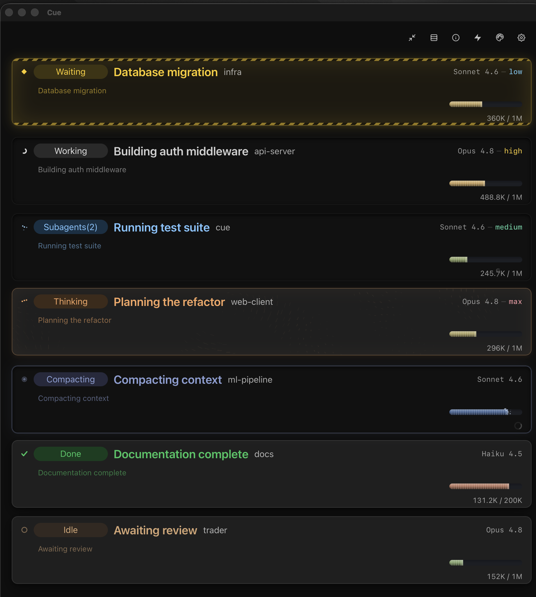

# Claude Cue

A real-time session monitor for Claude Code — see at a glance if Claude is working, waiting for permission, hit an error, or finished. Cross-platform desktop app for macOS, Windows, and Linux.




## Status Indicators

Each Claude Code session appears as a colored dot in your menu bar / system tray:

| Color | Meaning |
|-------|---------|
| Blinking white | Claude is working |
| Blinking cyan | Subagent running |
| Yellow | Waiting for your permission |
| Red | Tool error |
| Green | Done |
| Dim white | Idle |
| Hollow ring | No active sessions |

Multiple sessions show as a grid of dots — see all your sessions at once.

## Features

- **Real-time status** — polls every second, blink animation for active sessions
- **Multi-session support** — tracks up to 8 concurrent sessions as a dot grid
- **Permission approval** — approve/deny Claude Code permissions directly from the dashboard via HTTP hook
- **Token metrics** — incremental JSONL parsing for input/output/cache token counts
- **Usage tracking** — 5-hour, daily, and weekly usage windows with progress bars and cost estimates
- **Plan presets** — Pro, Max Standard, Max Plus token limits with one-click selection
- **Session dashboard** — detailed view with workspace, duration, model, git branch, tool usage
- **Smart summaries** — human-readable tool descriptions ("Run: `npm install`", "Edit: `src/main.rs`")
- **Audit log** — every permission decision logged to JSONL with timestamp and tool details
- **CLI with full stats** — `--status --pretty` for SSH/tiling WM users, `--compact` for dense output, ANSI colors auto-detected
- **Privacy-first** — shows only leaf directory names, full paths on hover only
- **Security-first** — no outbound network calls, atomic file writes, 0600 permissions, path sanitization
- **Automatic cleanup** — stale sessions expire and get pruned
- **File locking** — concurrent hooks don't clobber each other's updates
- **Accessibility** — ARIA labels, keyboard navigation, high contrast, reduced motion support

## Install

### macOS

```bash
cd claude-cue-desktop
npm install
npm run tauri build
cp -R src-tauri/target/release/bundle/macos/Claude\ Cue.app ~/Applications/
open ~/Applications/Claude\ Cue.app
```

The onboarding wizard configures the Claude Code hooks automatically on first launch.

To start on login: **System Settings > General > Login Items > add "Claude Cue"**

### Windows & Linux

See [claude-cue-desktop/INSTALL.md](claude-cue-desktop/INSTALL.md) for MSI, NSIS, AppImage, and .deb instructions.

### Development

```bash
cd claude-cue-desktop
npm install
npm run tauri dev
```

## How It Works

Claude Cue uses [Claude Code hooks](https://docs.anthropic.com/en/docs/claude-code/hooks) to track session state. A Python hook script writes session status to a platform-specific `sessions.json` on every lifecycle event:

```
SessionStart       → idle
PreToolUse         → working
PostToolUse        → working
UserPromptSubmit   → working
PermissionRequest  → waiting
PostToolUseFailure → error
SubagentStart      → subagent
SubagentStop       → working
Stop               → done
TaskCompleted      → done
Notification       → done
SessionEnd         → remove
```

The app reads `sessions.json` and renders the dot grid. Metrics are parsed incrementally from Claude's `.jsonl` conversation logs — only new bytes are read on each cycle, keeping CPU near 0%.

## Permission Approval

The desktop app includes a localhost HTTP server (`127.0.0.1:3002`) that integrates with Claude Code's `PermissionRequest` hook. When Claude Code needs permission to run a tool, the request appears inline under the relevant session in the dashboard:

- **Smart summary** — "Run: `npm install`", "Read: `package.json`", "Edit: `src/main.rs`"
- **Expandable details** — full `tool_input` JSON for review
- **Approve / Deny buttons** — decision is sent back to Claude Code immediately
- **No auto-timeout** — requests stay pending until you explicitly decide
- **Audit log** — every decision is recorded to `permission-log.jsonl`

If the desktop app isn't running, Claude Code falls back to its normal terminal/VSCode permission flow. The `install.sh` script configures both a command hook (updates tray status to "waiting") and an HTTP hook (sends the permission to the dashboard) for the `PermissionRequest` event.

## CLI Usage

Monitor sessions from the terminal — useful over SSH or on tiling window managers without a system tray.

```bash
# Rich multi-line output with all stats (colors auto-detected)
claude-cue-desktop --status --pretty

# Dense single-line-per-session format
claude-cue-desktop --status --pretty --compact

# JSON output for scripting (pipe to jq)
claude-cue-desktop --status

# Show full workspace paths (leaf name only by default)
claude-cue-desktop --status --pretty --show-paths
```

The CLI displays the same data as the GUI dashboard: session ID, messages, input/output tokens, tool breakdown, model, source client, cache hit %, context usage bar, git branch, and duration. Sessions are sorted with active states first (working/waiting/subagent), then idle, then done.

## Uninstall

```bash
rm -rf ~/Applications/Claude\ Cue.app
```

Then remove the hook entries from `~/.claude/settings.json` (search for `cue-hook`).

## Architecture

```
claude-cue-desktop/               # Cross-platform app (Tauri v2)
├── src-tauri/src/                # Rust backend
│   ├── lib.rs                    # Tauri commands, timers, tray + permission server
│   ├── session_monitor.rs        # Session polling + JSONL path resolution
│   ├── usage_aggregator.rs       # Usage aggregation across time windows
│   ├── jsonl_parser.rs           # Line-by-line JSONL parsing
│   ├── tray.rs                   # Dot grid icon rendering (tiny-skia)
│   ├── cli.rs                    # CLI --status/--pretty/--compact with full JSONL enrichment
│   ├── permission_server.rs      # Pending request channels + HTTP response formatting
│   ├── permission_log.rs         # JSONL audit log for permission decisions
│   ├── summary_formatter.rs      # Tool input → human-readable summaries
│   ├── security.rs               # Atomic writes, permissions, path sanitization
│   ├── settings.rs               # Settings load/save
│   ├── env_detect.rs             # Platform detection + hook auto-configuration
│   ├── models.rs                 # Shared data types
│   └── paths.rs                  # OS-specific path resolution
├── src/                          # React frontend
│   ├── components/               # Dashboard, SessionCard, UsageView, Settings, Onboarding,
│   │                             # PermissionPrompt, PermissionHistory
│   ├── hooks/                    # useSessionMonitor, useUsageMetrics, usePermissions
│   └── lib/                      # types, format, a11y utilities
└── src-tauri/tauri.conf.json     # Tauri config (minimal capabilities, no network)

hooks/
└── cue-hook                      # Python hook script (cross-platform)
```

## Security

- **No outbound network calls** — all data stays local, no telemetry, no HTTP clients. Localhost-only server (`127.0.0.1`) for hook communication
- **Atomic file writes** — temp file → fsync → rename prevents data corruption
- **File permissions** — 0600 on Unix for all data files
- **Path sanitization** — rejects `..` traversal, validates workspace paths
- **Hook validation** — rejects shell metacharacters in hook paths
- **Minimal capabilities** — Tauri frontend has no shell, HTTP, or filesystem access
- **DevTools disabled** — in release builds
- **Privacy** — workspace paths show leaf directory name only

## avonbereghy

Claude Cue is part of [avonbereghy](https://github.com/avonbereghy), a collection of tools for Claude Code:

| Project | What It Does |
|---------|-------------|
| **[Claude Symphony](https://github.com/avonbereghy/claude-symphony)** | Workflow methodology + slash commands for project generation |
| **[Claude Conductor](https://github.com/avonbereghy/claude-conductor)** | Native macOS app for managing Claude Code configuration |
| **[Claude Cue](https://github.com/avonbereghy/claude-cue)** | Status line indicator for Claude Code sessions |

## License

MIT
